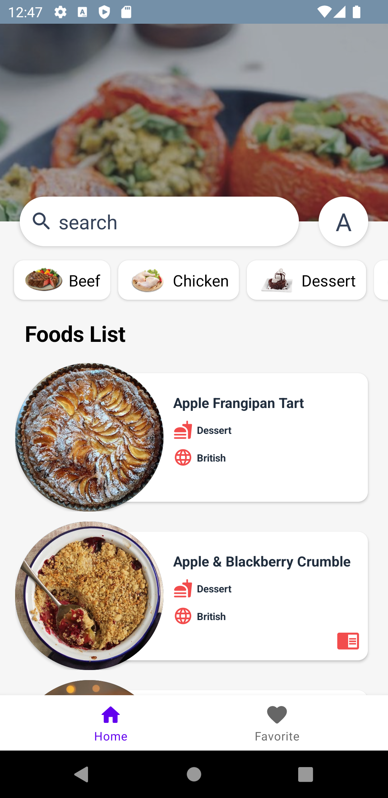
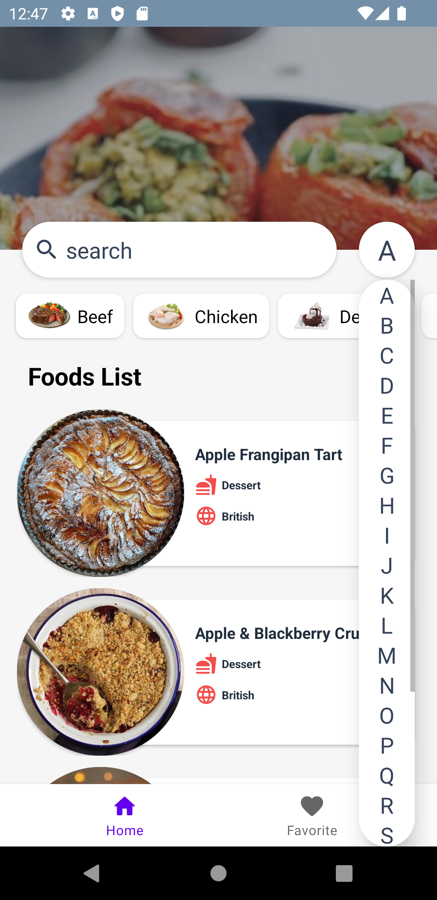
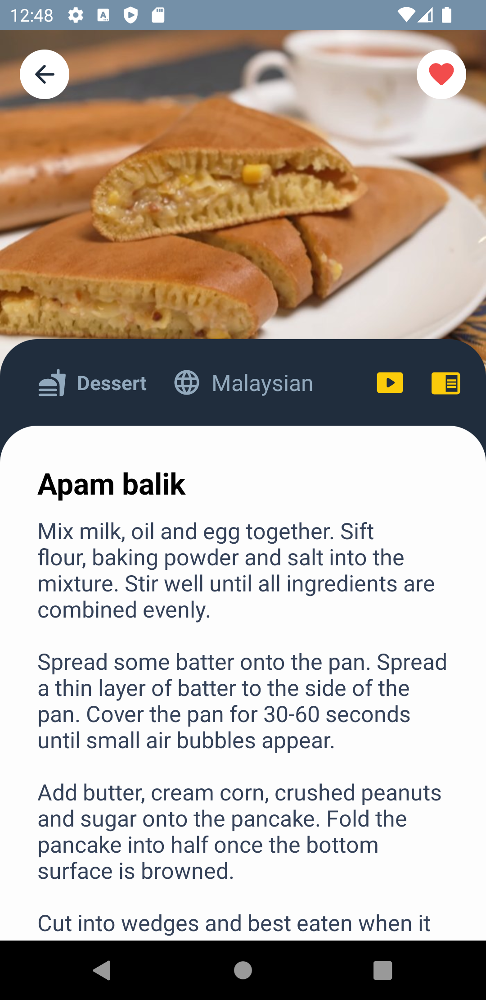
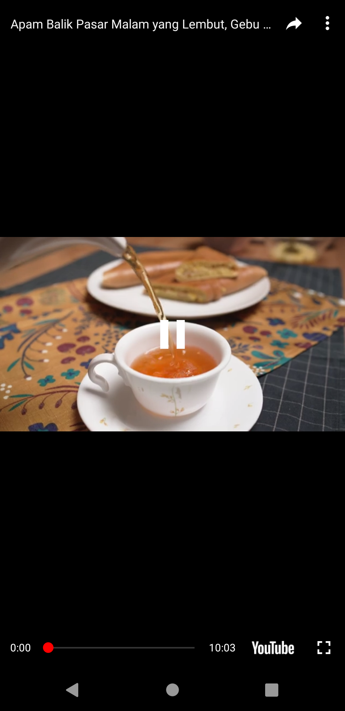
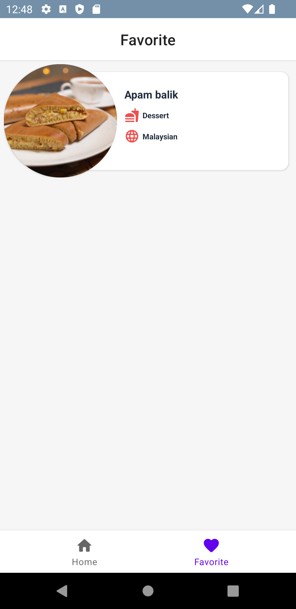

# MVI-TheMealdb-API

Overview :

The purpose of this project series is to show different architectures with different structures, and you can check these architectures and structures.

This project in

- MVP architecture : https://github.com/ezatpanah/MVP-TheMealdb-API [ Room Database - RxJava - Dagger Hilt - Lottie - View Binding ]
- MVVM architecture : https://github.com/ezatpanah/MVVM-TheMealdb-API [ Room Database - Dagger Hilt - Flow - Coroutine - LiveData]
- MVI architecture : Current Repo

The app was written in Kotlin.

TheMealDB API: An open, crowd-sourced database of Recipes from around the world. The API’s Docs: https://themealdb.com/api.php

Technologies and Libraries Used :

- MVI
- Navigation Component
- View Binding
- Retrofit
- Dagger Hilt
- Flow
- StateFlow
- Room Database
- Coil
- Youtube API
- Lottie

Screen-Shot :
 

